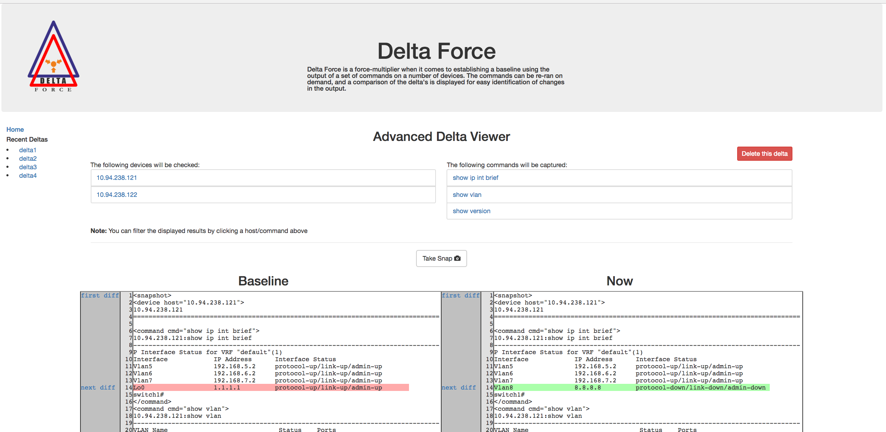

# delta-force

## Description

Delta Force allows network operators to capture a baseline of an environment by capturing the output
of an arbitrary number of commands on an arbitrary number of network devices. After the baseline is established
on demand snapshots of the same commands on the same devices can be run periodically.  The differences between
the baseline and the most recent snapshot are displayed.

The difference between the baseline and the snapshot is also sortable

* Display differences from a single command output from all devices
* Display differences from all commands on a single device

 Some sample scenarios

 * Pre/Post Change Verification
 * Reachability Tests (via ping commands)
 * Problem Identification (has anything changed since?)

### Screenshot


## Installation

Create a python virtual environment and install dependencies
```
virtualenv venv
source venv/bin/activate
pip install -r requirements.txt
```

## Running

```
python app.py
```

## Docker

You can also run delta force in a docker container

```
docker build -t deltaforce .
docker run -p 5000:5000 deltaforce

```

## Usage

navigate to http://127.0.0.1:5000/ and start taking snapshots ;)
